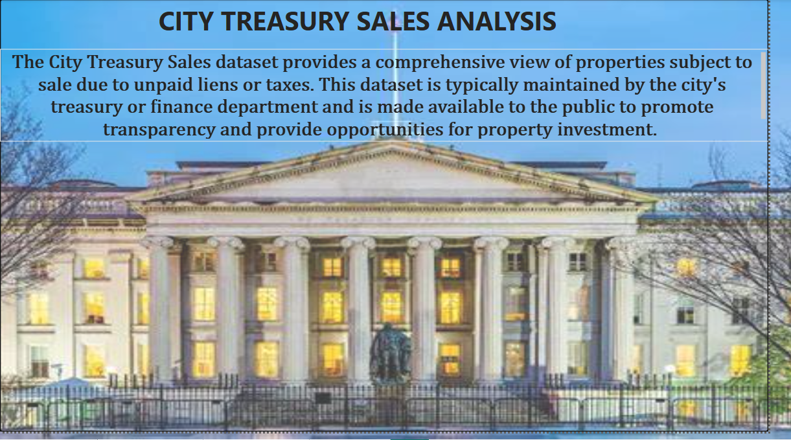
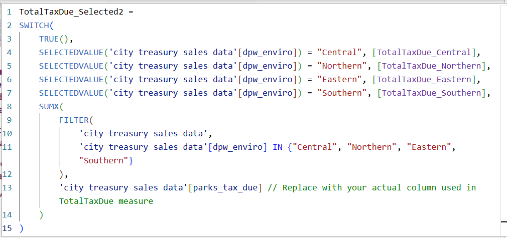
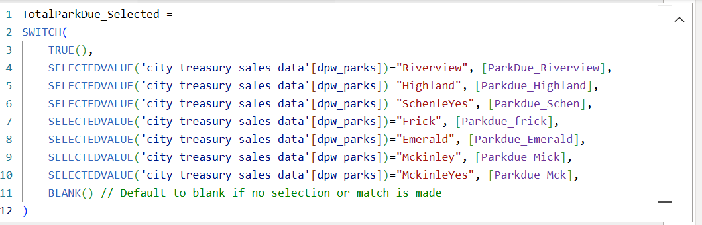
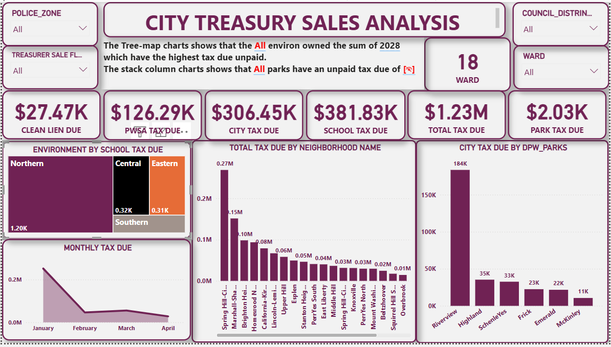
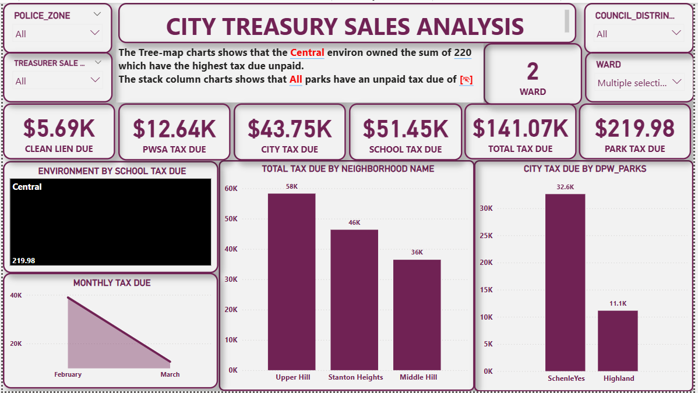

# CITY-TREASURY-SALES-ANALYSIS

## 1. Introduction

The City Treasury Sales dataset offers a thorough overview of properties that are subject to sale due to unpaid liens or taxes. This dataset is typically managed and maintained by the city's treasury or finance department. Its availability to the public serves a dual purpose: promoting transparency within the city's financial operations and creating opportunities for property investment.

## 2. About Dataset
* **Purpose:** It provides a comprehensive view of properties that are subject to sale.
* **Reason for Sale:** These properties are typically put up for sale due to unpaid liens or taxes.
* **Maintenance:** The dataset is usually maintained by the city's treasury or finance department.
* **Public Availability:** It is explicitly stated that this dataset is "made available to the public."
* **Goals of Public Availability:**
  * To promote transparency.
  * To provide opportunities for property investment.
    
In essence, it's a public record of properties that the city is looking to sell to recover outstanding debts (liens or taxes), and it's made accessible to foster openness and encourage investment in those properties.

## 3. Purpose of the Dataset
The primary purpose of the "City Treasury Sales" dataset is to catalog and track properties that are being offered for sale by the city due to outstanding financial obligations. These obligations typically include:

1. **Unpaid Liens:** These are legal claims against a property for a debt, such as for unpaid municipal services (e.g., parks, security, sanitation)
2. **Unpaid Taxes:** This refers to delinquent property taxes that have not been paid by the homeowner or property owner.

## 4. Problem Statement
Cities often face challenges in efficiently managing and recovering delinquent property taxes and unpaid liens. Without a clear, consolidated view, it can be difficult to:
* Identify high-impact areas where tax delinquency is most prevalent.
* Track the total amount of outstanding taxes and liens across different categories.
* Provide transparent and accessible information to the public and potential investors regarding properties available for treasury sale.

This dashboard aims to address these challenges by visualizing key financial data related to city treasury sales.

##  5. Data Source
The analysis is based on a simulated or real-world "City Treasury Sales" dataset, containing information about properties with unpaid liens or taxes. While specific column names and data types would vary by city, a typical dataset would include details such as:
* **Property Identifiers:** Unique IDs, addresses, police zones, council districts, wards, neighborhood names.
* **Financial Details:** Amounts for clean liens due, PWSA tax due, city tax due, school tax due, park tax due, and total tax due.
* **Temporal Data:** Dates related to tax delinquency or sale cycles.

## 6. Methodology
The development of this analysis involved the following key steps:
1.  **Data Collection & Cleaning:** Sourcing and preprocessing raw data to ensure accuracy and consistency across various property attributes and financial figures.
2.  **Data Transformation:** Aggregating and structuring data to derive meaningful metrics, such as total tax due by neighborhood or monthly trends.
3.  **Dashboard Development:** Utilizing a business intelligence tool (e.g., Power BI) to create interactive visualizations.
4.  **Dynamic text** refers to content that is generated or updated in real-time based on user interactions, data changes, or other conditions. Unlike static text, which remains fixed and unchanged, dynamic text adjusts to reflect the current state of the system or user input. 
In Power BI, dynamic text is often used to create reports and dashboards that adapt based on user interactions or data changes. Here’s how it typically works:
5.  **DAX Measures**: Data Analysis Expressions (DAX) can be used to create measures that generate text dynamically based on the underlying data. For example, you could create a measure to display a message if sales are above or below a certain threshold.

## 7. Key Features and Insights

The dashboard provides a multi-faceted view of city treasury sales, featuring various interactive visualizations:

* **Summary Cards:** Prominently display key aggregated financial metrics:
    * **Clean Lien Due:** Total outstanding amounts for clean liens.
    * **PWSA Tax Due:** Public Water & Sewer Authority tax due.
    * **City Tax Due:** Unpaid city property taxes.
    * **School Tax Due:** Unpaid school taxes.
    * **Total Tax Due:** The overall sum of all outstanding taxes and liens.
    * **Park Tax Due:** Specific tax related to park assessments.

* **Police Zone & Council District Filters:** Allow users to filter the entire dashboard by specific geographical or administrative areas for targeted analysis.

* **Treasurer Sale & Ward Filters:** Provide additional granular filtering options, enabling drill-down into specific sale types or ward-level data.

* **Environment by School Tax Due (Tree-map):**
    * "The Tree-map chart shows that the All environ owned the sum of $2028 which have the highest tax due unpaid." (This line from your image suggests 'All' represents a significant category or aggregation, which could be clarified.) This visualization helps identify which environmental zones have the highest outstanding school tax burdens, guiding targeted intervention or investment.

* **Total Tax Due by Neighborhood Name (Bar Chart):**
    * Displays the total outstanding tax due for various neighborhoods (e.g., Spring Hill, Chartiers City, California-Kirkbride, etc.). This helps pinpoint geographical hotspots of delinquency, indicating areas that might require focused collection efforts or community support.

* **City Tax Due by DPW_Parks (Bar Chart):**
    * "The stack column charts shows that All parks have an unpaid tax due of " (Referring to the value in the image: "184K"). This chart highlights the city tax owed specifically by properties related to DPW Parks, showing which parks or park-adjacent areas have significant unpaid dues.

* **Monthly Tax Due (Line Chart):**
    * Tracks the trend of tax due over time (January to April in the example). This helps identify seasonal patterns or specific months where tax delinquency spikes or decreases, informing future financial planning and collection strategies.

**Key Insights from the Dashboard:**
* The **Total Tax Due** of **\$1.23M** indicates a substantial amount of outstanding revenue for the city.
* **School Tax Due (\$381.83K)** and **City Tax Due (\$306.45K)** represent significant portions of the total.
* The tree-map suggests a particular 'Environment' (perhaps a general category) accounts for a large sum of school tax due.
* Specific neighborhoods like **Spring Hill-City View** and **Chartiers City** appear to have the highest total tax due, warranting further investigation.
* **Riverview** and **Highland** parks show the highest city tax due.
* The **Monthly Tax Due** shows a decrease from January to April, which could indicate successful collection efforts or a natural cycle in delinquency reporting.

## 8. Challenges and Learnings

During the development of this dashboard, several challenges were addressed:

* **Data Quality and Consistency:** Ensuring uniformity across various tax and lien categories, as well as property attributes (e.g., police zones, neighborhoods), was critical. This involved extensive data cleaning and standardization.
* **Data Integration:** Merging data from potentially disparate sources (e.g., tax records, property databases, lien systems) required careful planning to establish accurate relationships between different data points.
* **Performance Optimization:** For large datasets, optimizing queries and dashboard load times was important to ensure a smooth user experience.
* **Effective Visualization Design:** Selecting the most appropriate chart types to convey complex financial information clearly and concisely was a continuous process, aiming to balance detail with immediate insights.
* **Defining Actionable Metrics:** Collaborating with stakeholders to define which metrics were most valuable for tracking city treasury sales and outstanding dues.
  
## 9. Future Enhancements

Potential future enhancements for this dashboard include:

* **Predictive Analytics:** Incorporating models to forecast future tax delinquency trends or identify properties at high risk of default.
* **Geospatial Mapping:** Integrating interactive maps to visualize delinquent properties by exact location, allowing for more precise geographical analysis.
* **Automated Data Refresh:** Setting up a robust pipeline for daily or weekly automated data updates to ensure the dashboard always displays the most current information.
* **User Access Controls:** Implementing roles and permissions for different user groups (e.g., finance department, public viewers).
* **Historical Performance Analysis:** Adding features to compare current performance against historical data to track progress in tax recovery.
* **Drill-through Capabilities:** Enabling users to click on a specific data point (e.g., a neighborhood) and drill down to a detailed list of properties within that selection.

## 10. Recommendation and Conclusion
This City Treasury Sales Analysis dashboard serves as a vital tool for promoting transparency and enabling data-driven decisions within municipal finance. The insights derived from visualizing delinquent taxes and liens can significantly aid city treasury departments in prioritizing collection efforts and optimizing revenue recovery strategies.

By making this information accessible, the dashboard also empowers potential investors to identify valuable property opportunities, fostering economic activity. The suggested future enhancements, such as predictive analytics and geospatial mapping, would further elevate its utility, transforming it into a more proactive and spatially intelligent asset management system. This project demonstrates a strong foundation in data analysis and visualization for addressing real-world urban challenges.

Thank you for your interest and time. Your valuable suggestions are welcome. Feel free to connect with me for further discussion. [here](https://www.linkedin.com/in/nzubechukwu-nwafor-pmb-acihrm-58ba80201)

